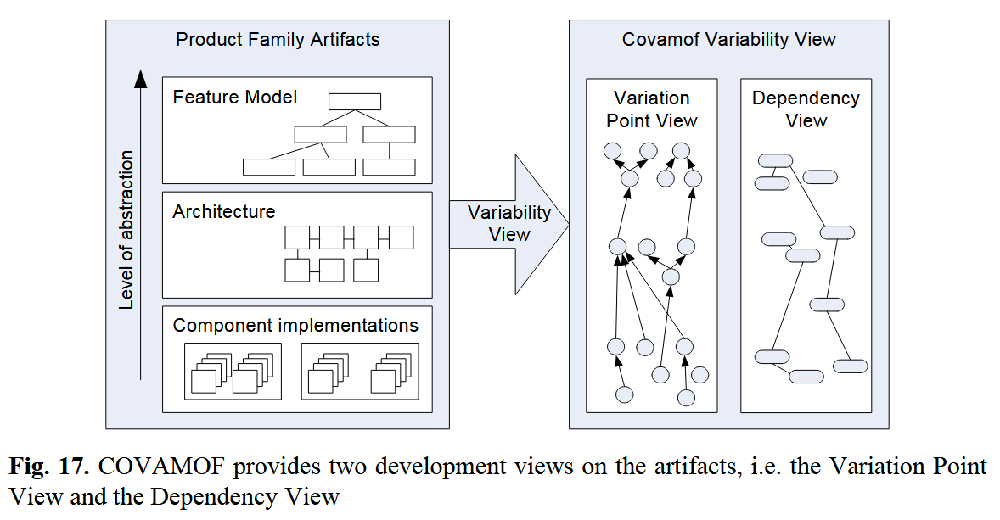

**Variability Dimensions:**
- application domain / product type / feature set
- execution environment (OS, hardware)
- implementation (technologies, UI)
- context at runtime (time, space, user)
- non functional properties / software quality attributes

Causes:
- stakeholder needs
- market-specific legislation / laws + standards

**orthogonal variability model (OVM):**
- COVAMOF

**our Dimensions:**
- metamodel exchangeability
- editor functionality / features
- target platform (theia, vs code, web application)
- notion / viewpoint
- internal technical variability (of GLSP)
    - input file format
    - layout
    - GLSP internal
        - source model
        - graphical model
        - shape model
        - modeltypes
